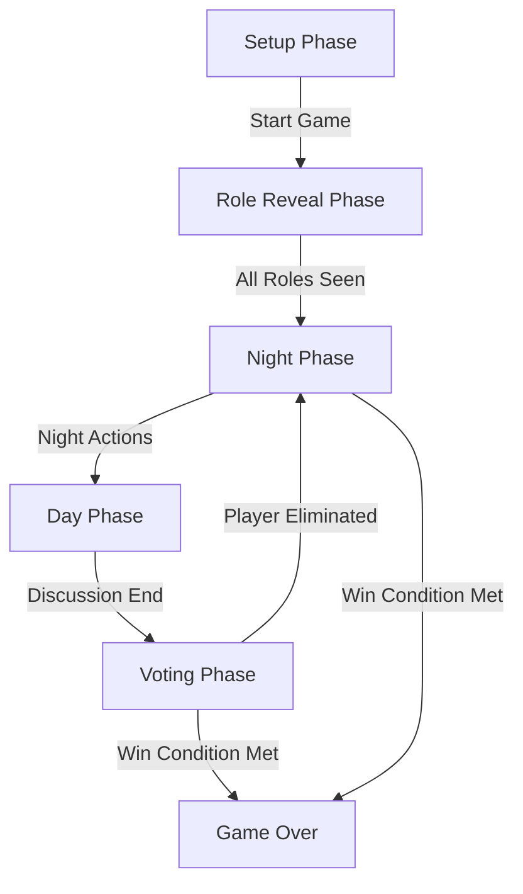

<div align="center">
  <h1 align="center">🐺 Werewolf Board Game</h1>
  <h3>A Modern, Interactive Werewolf Game Web Application</h3>
  <p>
    Built with <strong>React 19</strong>, <strong>Vite</strong>, and <strong>Tailwind CSS</strong>.
  </p>
  <p>
    <a href="#key-features">Key Features</a> •
    <a href="#overall-architecture">Architecture</a> •
    <a href="#installation">Installation</a> •
    <a href="#folder-structure">Structure</a>
  </p>
</div>

---

## 📖 Introduction

**Werewolf Board Game** is a web-based implementation of the classic social deduction game **Werewolf (Ma Sói)**, tailored for Vietnamese players. It facilitates the complex moderation of the game, handling role assignments, night actions, voting logic, and win conditions automatically. Designed for "Pass & Play" offline multiplayer scenarios, it eliminates the need for a human moderator to track the game state manually.

Whether you are a group of friends gathering for a game night or a team building event, Werewolf Board Game provides a seamless, error-free, and immersive experience with a professional, dark-themed UI.

## ✨ Key Features

-   **🎭 Automated Game Logic**: Handles complex role interactions (Seer, Guard, Witch, Cupid, etc.) and win conditions automatically.
-   **📱 Fully Responsive Design**: Mobile-first architecture ensures a perfect experience on smartphones and tablets.
-   **🎨 Modern UI/UX**:
    -   Sleek Dark/Light mode support.
    -   Smooth animations and transitions.
    -   Professional color palette (Slate & Red-Orange gradients).
-   **⚙️ Dynamic Setup**:
    -   Support for 7-30 players.
    -   Flexible role distribution adjustments.
    -   Smart validation (e.g., ensuring Werewolves < Villagers).
-   **📜 Detailed Game History**: A timeline that logs every important event (kills, saves, checks, votes) for post-game analysis.
-   **🗳️ Voting System**: Built-in voting interface with support for blank votes and tie counting.

### Supported Roles
| Role | Icon | Description |
| :--- | :---: | :--- |
| **Werewolf** | 🐺 | Wake up at night to choose a victim. Requires consensus. |
| **Villager** | 👱 | No special abilities. Try to find the wolves during the day. |
| **Seer** | 🔮 | Wake up to reveal the faction of one player. |
| **Guard** | 🛡️ | Protect one player from being killed each night. |
| **Witch** | 🧙‍♀️ | Has one Heal potion and one Poison potion. |
| **Cupid** | 💘 | Links two players as lovers at the start of the game. |
| **Jester** | 🤡 | Wins if they get voted out during the day. |

## 🏗️ Overall Architecture

Masoi is built as a Single Page Application (SPA) using React. It relies on a centralized game state hook (`useGameState`) to manage the phases and logic.

### Game Flow


### Tech Stack
-   **Frontend Framework**: React 19
-   **Build Tool**: Vite 7
-   **Styling**: Tailwind CSS 3.4 & PostCSS
-   **State Management**: Custom React Hooks

## 🚀 Installation

Follow these steps to set up the project locally.

### Prerequisites
-   **Node.js**: v18.0.0 or higher
-   **npm**: v9.0.0 or higher

### Steps

1.  **Clone the repository**
    ```bash
    git clone https://github.com/GnauqTheBeast/werewolf-boardgame.git
    cd werewolf-boardgame
    ```

2.  **Install dependencies**
    ```bash
    npm install
    ```

3.  **Start the development server**
    ```bash
    npm run dev
    ```

4.  **Open your browser**
    Navigate to `http://localhost:5173` to see the app running.

## 🛠️ Configuration

The game configuration can be tweaked in `src/constants/gameConfig.js`.

| Constant | Description | Default |
| :--- | :--- | :--- |
| `MIN_PLAYERS` | Minimum number of players required | `7` |
| `MAX_PLAYERS` | Maximum number of players allowed | `30` |
| `EVENT_TYPES` | Constants for history logging | - |

## 📂 Folder Structure

```
werewolf-boardgame/
├── public/              # Static assets
├── src/
│   ├── components/      # React components (UI)
│   │   ├── SetupScreen.jsx   # Game configuration
│   │   ├── NightPhase.jsx    # Night logic & interaction
│   │   ├── VotingPhase.jsx   # Day voting logic
│   │   └── ...
│   ├── constants/       # Static data & configs
│   │   ├── roles.js          # Role definitions
│   │   └── gameConfig.js     # Global game settings
│   ├── hooks/           # Custom React Hooks
│   │   ├── useGameState.js   # Core game engine logic
│   │   └── useTheme.js       # Dark/Light mode logic
│   ├── utils/           # Helper functions
│   │   └── gameLogic.js      # Pure functions for game rules
│   ├── App.jsx          # Main application layout
│   └── index.css        # Tailwind directives & global styles
├── tailwind.config.js   # Tailwind CSS configuration
└── vite.config.js       # Vite configuration
```

## 🤝 Contribution Guidelines

We welcome contributions to improvement Werewolf-boardgame! Please follow these steps:

1.  Fork the repository.
2.  Create a new branch: `git checkout -b feature/amazing-feature`.
3.  Commit your changes: `git commit -m 'Add some amazing feature'`.
4.  Push to the branch: `git push origin feature/amazing-feature`.
5.  Open a Pull Request.

Please ensure your code follows the existing style, uses Tailwind CSS for styling, and passes all linting checks.

---

<div align="center">
  Made with ❤️ by <strong>QuangNguyen</strong>
</div>
